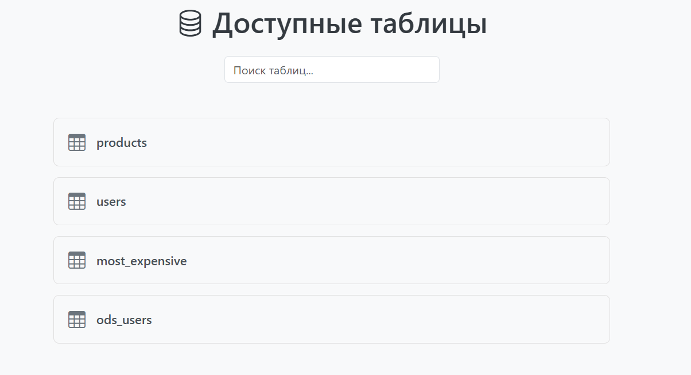
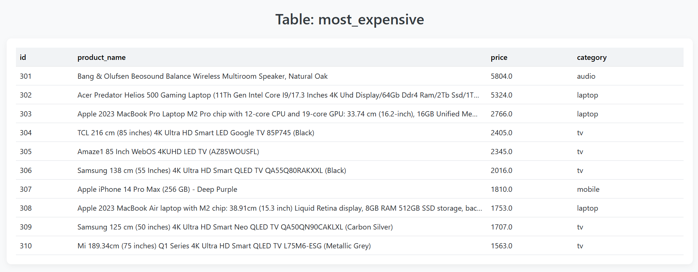
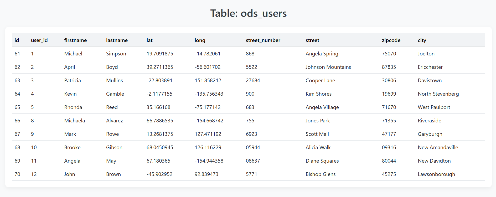
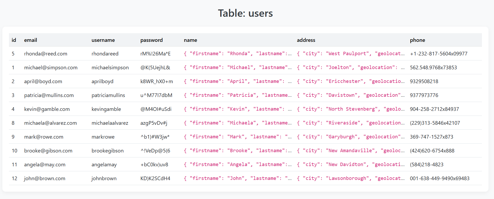
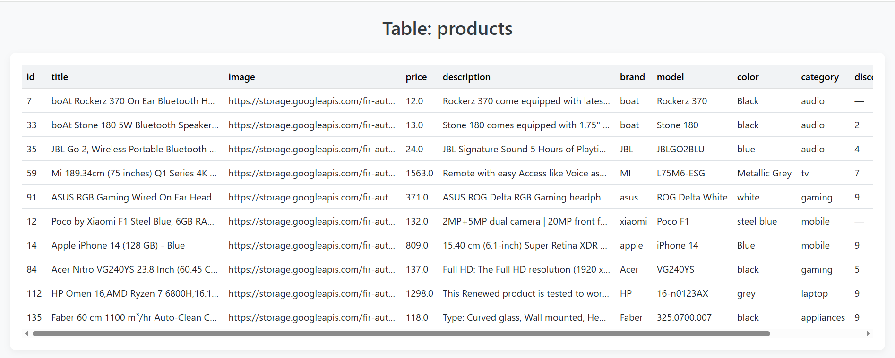

### Задачи

####  1. Исключить один список из другого (easy)

**Условие задачи:**
```python
recom_ids = [2, 3, 1] 
seen_ids = [3, 10, 20]
filtered ?= [2, 1]
```
а. надо составить новый список айдишников
б. в том же порядке что recom_ids
в. НЕ содержит seen_ids


#### 2. Написать декоратор, который выполняет функцию N раз и выводит общее время выполнения.

#### 3. Система анализа продаж с ETL-процессом

Цель: создать систему ETL (Extract, Transform, Load) для анализа данных о продажах.

**Задачи**:

1. **Извлечение данных (Extract)**:
   - Загрузить данные о товарах из API FakeStore (https://fakestoreapi.in/docs, эндпоинт /products)
   - Загрузить данные о пользователях из того же API (эндпоинт /users)

2. **Загрузка в БД (Load)**:
   - Создать таблицу products и загрузить в нее данные о товарах
   - Создать таблицу users с полями name и address в формате JSON

3. **Трансформация данных (Transform)**:
   - Создать таблицу most_expensive с колонками: 
     - Имя товаров (название товара)
     - цена 
     - категория
     - Поместить в нее 10 самых дорогих товаров с помощью SQL-запроса
   - Создать таблицу ods_users с преобразованными данными из users:
     - Из поля name извлечь firstname и lastname
     - Из поля address извлечь: lat, long, number, street, zipcode

**Требования к реализации**:
- Использовать PostgreSQL (предпочтительно) или другую реляционную БД
- Код должен быть написан на python который запускает последовательно sql cкрипты
- Код должен быть читаемым и сопровождаемым
- Желательно добавить самую простую документацию или комментарии

**Критерии оценки**:
1. Корректность работы ETL-процесса
2. Оптимальность SQL-запросов
3. Обработка возможных ошибок (отсутствие соединения, некорректные данные и т.д.)
4. Чистота и структурированность кода
5. Качество документации (README с инструкциями)

Задание 1-2 -> the_first_two_tasks
Задание 3 -> src

# Sales Analysis ETL System (v3.0)

## System Overview
ETL pipeline for sales data analysis that:
1. Extracts product/user data from FakeStore API
2. Transforms data according to business logic
3. Loads results into PostgreSQL
4. Provides simple API for accessing analyzed data

## Requirements
- Python 3.9+
- PostgreSQL 13+
- Docker
- Poetry

## Quick Start

```bash
- git clone https://github.com/marryivanova/ETL.git
- python -m venv venv
- venv\Scripts\activate  
- cd ETL
- pip install poetry
- poetry install
- cd C:\..\..\..\..\src\docker
- docker-compose -f docker-compose.yaml up -d db
- alembic upgrade head (alembic.ini -> url !!!)
- python main.py

-> Access system at: http://127.0.0.1:8000
```
Очень важно!!

* при запуске миграций указать полный адресс `sqlalchemy.url = postgresql:/`

* если будет выеживатся установите -> `pip install psycopg[binary]`

```
alembic upgrade head

INFO  [alembic.runtime.migration] Context impl PostgresqlImpl.
INFO  [alembic.runtime.migration] Will assume transactional DDL.
INFO  [alembic.runtime.migration] Running upgrade  -> 77993181fb00
INFO  [alembic.runtime.migration] Running upgrade 77993181fb00 -> 1cb41b4aac2b, add most_expensive and ods_users tables
INFO  [alembic.runtime.migration] Running upgrade 1cb41b4aac2b -> aed1d4037978, add city column to ods_users
INFO  [alembic.runtime.migration] Running upgrade aed1d4037978 -> ba8b1a6d6b7c, change_primary_key_to_id
```

#### table
<figure>
  
  <figcaption>list table</figcaption>
</figure>

<figure>
  
  <figcaption>table most exp</figcaption>
</figure>

<figure>
  
  <figcaption>table ods user</figcaption>
</figure>

<figure>
  
  <figcaption>table users</figcaption>
</figure>

<figure>
  
  <figcaption>table products</figcaption>
</figure>
